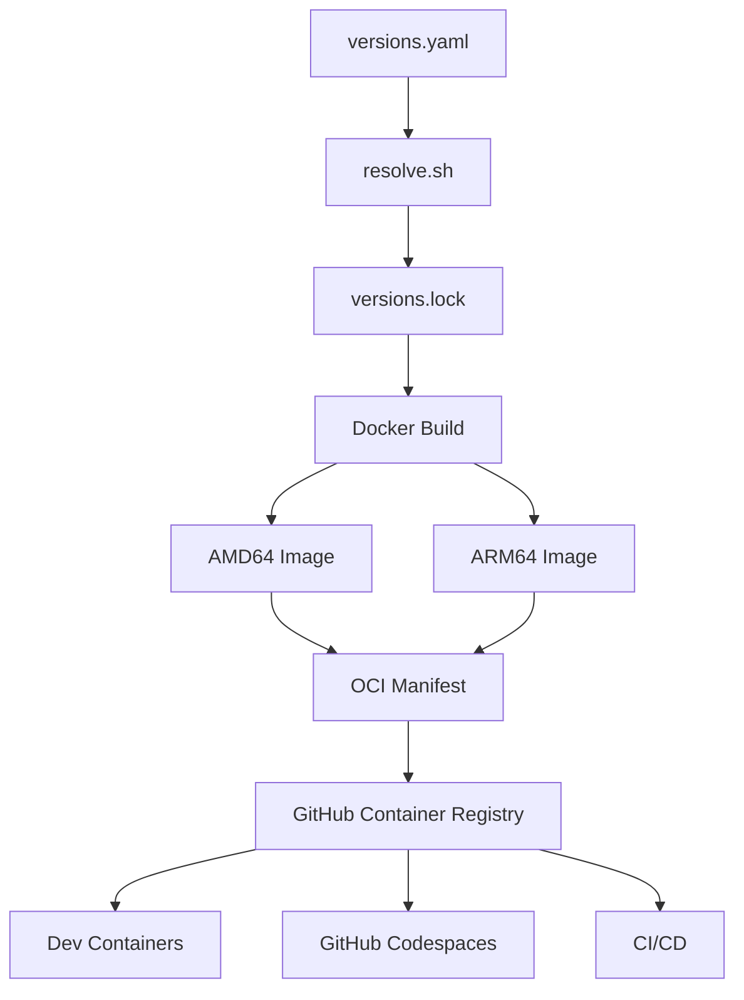
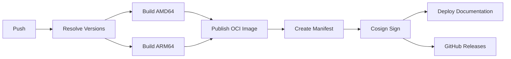
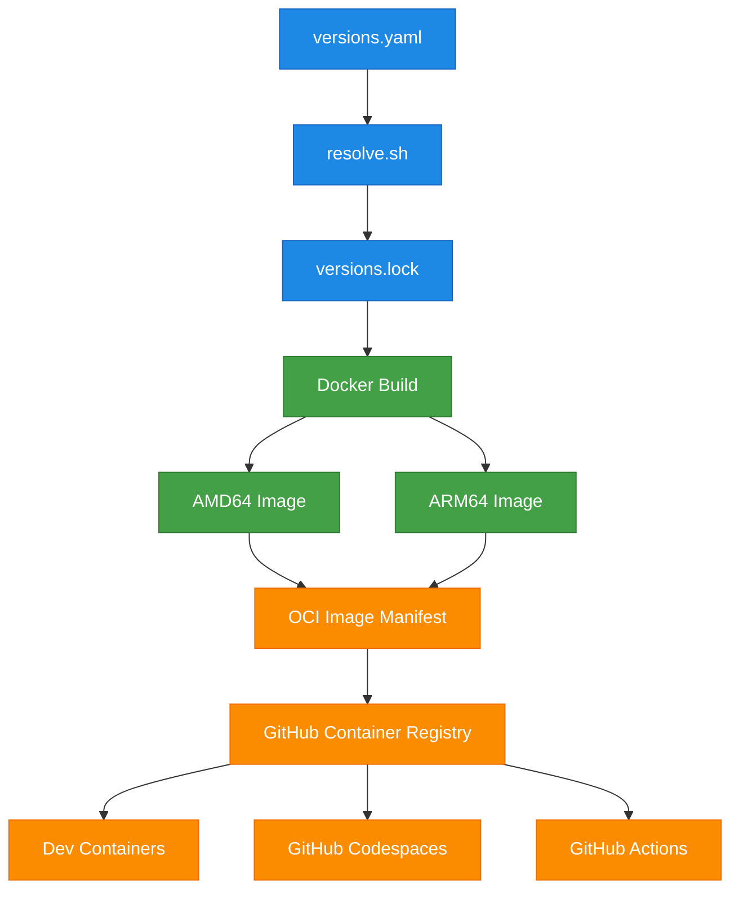
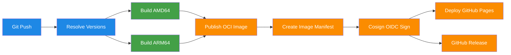

<!-- ==========================================================================
     HERO
========================================================================== -->

<section class="hero">

<div class="hero-content">

# Enterprise Development Infrastructure

Build faster with a deterministic, enterprise-grade development platform that delivers identical environments across local machines, Dev Containers, GitHub Codespaces, and CI/CD pipelines.

<div class="hero-actions">

<a
    href="usage/"
    class="md-button md-button--primary">
    Get Started
</a>

<a
    href="https://github.com/codespaces/new?hide_repo_select=true&ref=main&repo=YOUR_REPOSITORY_ID"
    class="md-button">
    Launch in Codespaces
</a>

</div>

</div>

<div class="hero-terminal">

<div class="hero-terminal-header">

<span></span>
<span></span>
<span></span>

</div>

```console
$ ./scripts/verify.sh

━━━━━━━━━━━━━━━━━━━━━━━━━━━━━━━━━━━━━━━━━━━━━━━━━━━━━━━━━━━━━━

BAOBAB Development Platform Verification

━━━━━━━━━━━━━━━━━━━━━━━━━━━━━━━━━━━━━━━━━━━━━━━━━━━━━━━━━━━━━━

✓ Ubuntu 26.04 LTS
✓ Python 3.14
✓ uv Package Manager
✓ Flutter SDK
✓ Node.js LTS
✓ Docker CLI
✓ PostgreSQL Client
✓ GitHub CLI

Environment verified.

Ready for development.
```

</div>

</section>

<!-- ==========================================================================
     BUILT ON PROVEN TECHNOLOGIES
========================================================================== -->

## Built on Proven Technologies

<section class="tech-strip">

<div class="tech-item">

:material-ubuntu:

### Ubuntu 26.04

Stable LTS foundation

</div>

<div class="tech-item">

:material-cpu-64-bit:

### AMD64 & ARM64

Native multi-architecture support

</div>

<div class="tech-item">

:material-language-python:

### Python 3.14

Powered by **uv**

</div>

<div class="tech-item">

:material-docker:

### Docker

Dev Containers Ready

</div>

<div class="tech-item">

:material-microsoft-visual-studio-code:

### GitHub Codespaces

Cloud-native development

</div>

<div class="tech-item">

:material-github:

### GitHub Actions

Automated CI/CD

</div>

<div class="tech-item">

:material-book-open-page-variant:

### MkDocs Material

Beautiful documentation

</div>

<div class="tech-item">

:material-shield-check:

### Apache 2.0

Open-source licensed

</div>

</section>

<!-- ==========================================================================
     KEY CAPABILITIES
========================================================================== -->

## Engineered for Modern Software Delivery

From local development to enterprise CI/CD, BAOBAB provides a deterministic, production-ready platform that eliminates environment drift and accelerates developer productivity.

<section class="feature-grid">

<div class="feature-card">

<div class="feature-icon">

:material-refresh-auto:

</div>

### Deterministic Development

Build once, develop everywhere. Every workstation, GitHub Codespace, and CI runner uses the same version-locked environment.

<ul class="feature-list">
<li>Single source of truth</li>
<li>Reproducible builds</li>
<li>Zero configuration drift</li>
</ul>

</div>

<div class="feature-card">

<div class="feature-icon">

:material-cpu-64-bit:

</div>

### Multi-Architecture Support

Run natively on AMD64 and ARM64 without maintaining separate images, scripts, or workflows.

<ul class="feature-list">
<li>Linux AMD64</li>
<li>Linux ARM64</li>
<li>Apple Silicon ready</li>
</ul>

</div>

<div class="feature-card">

<div class="feature-icon">

:material-office-building:

</div>

### Enterprise Foundation

Designed for scalable SaaS applications with a modern multi-tenant architecture built on proven technologies.

<ul class="feature-list">
<li>django-tenants</li>
<li>PostgreSQL</li>
<li>Production-ready architecture</li>
</ul>

</div>

<div class="feature-card">

<div class="feature-icon">

:material-language-python:

</div>

### Modern Python Toolchain

A carefully curated development stack focused on speed, reproducibility, and developer experience.

<ul class="feature-list">
<li>Python 3.14</li>
<li>uv package manager</li>
<li>MkDocs Material</li>
</ul>

</div>

<div class="feature-card">

<div class="feature-icon">

:material-rocket-launch:

</div>

### Integrated DevOps

Automate building, testing, publishing, documentation, and image signing using GitHub-native workflows.

<ul class="feature-list">
<li>GitHub Actions</li>
<li>OCI image publishing</li>
<li>Cosign OIDC signing</li>
</ul>

</div>

<div class="feature-card">

<div class="feature-icon">

:material-laptop:

</div>

### Exceptional Developer Experience

Start coding in minutes with a complete development environment that works consistently everywhere.

<ul class="feature-list">
<li>VS Code Dev Containers</li>
<li>GitHub Codespaces</li>
<li>Built-in verification tools</li>
</ul>

</div>

</section>


<!-- ==========================================================================
     INTERACTIVE SHOWCASE
========================================================================== -->

## Explore BAOBAB in Action

Every component of BAOBAB is designed to provide a predictable, enterprise-grade development experience. Explore how environments are built, verified, and continuously delivered.

---

=== ":material-sitemap: Environment Architecture"

<div class="showcase">

<div class="showcase-content">

### One Platform. Every Environment.

BAOBAB delivers the same deterministic development experience across local workstations, VS Code Dev Containers, GitHub Codespaces, and GitHub Actions.

Every image is generated from a single version manifest, ensuring consistency from development through production.

<ul class="feature-list">
<li>Single source of truth</li>
<li>Deterministic builds</li>
<li>Multi-architecture images</li>
<li>Identical developer experience</li>
</ul>

</div>

<div class="showcase-code">



</div>

</div>

---

=== ":material-stethoscope: Verification & Health Checks"

<div class="showcase">

<div class="showcase-content">

### Trust Every Environment

Before development begins, BAOBAB verifies that every required component is installed, correctly configured, and operating as expected.

Health verification provides immediate confidence that every developer and every CI runner starts from the same known-good environment.

<ul class="feature-list">
<li>Environment validation</li>
<li>Toolchain verification</li>
<li>Version consistency</li>
<li>Instant diagnostics</li>
</ul>

</div>

<div class="showcase-code">

```console
$ ./scripts/verify.sh

━━━━━━━━━━━━━━━━━━━━━━━━━━━━━━━━━━━━━━━━━━━━━━━━━━━━━━

BAOBAB Development Platform Verification

━━━━━━━━━━━━━━━━━━━━━━━━━━━━━━━━━━━━━━━━━━━━━━━━━━━━━━

✓ Ubuntu 26.04 LTS

✓ Python 3.14

✓ uv Package Manager

✓ Flutter SDK

✓ Node.js LTS

✓ Docker CLI

✓ GitHub CLI

✓ PostgreSQL Client

✓ Git configured

✓ Workspace healthy

━━━━━━━━━━━━━━━━━━━━━━━━━━━━━━━━━━━━━━━━━━━━━━━━━━━━━━

Environment verified.

Ready for development.
```

</div>

</div>

---

=== ":material-github: CI/CD & Automated Delivery"

<div class="showcase">

<div class="showcase-content">

### From Commit to Production

Every release is automatically built, validated, published, signed, and documented through GitHub Actions.

The entire pipeline is reproducible, secure, and optimized for both AMD64 and ARM64 architectures.

<ul class="feature-list">
<li>GitHub Actions automation</li>
<li>Multi-architecture builds</li>
<li>Cosign OIDC signing</li>
<li>GitHub Pages deployment</li>
</ul>

</div>

<div class="showcase-code">



</div>

</div>


<!-- ==========================================================================
     INTERACTIVE FEATURE SHOWCASE
============================================================================ -->

## Explore BAOBAB in Action

BAOBAB combines deterministic version management, comprehensive environment verification, and automated software delivery into a single, enterprise-grade development platform. Explore how the platform builds, validates, and delivers identical development environments across every stage of the software lifecycle.

=== ":material-sitemap: Environment Architecture"

<div class="showcase">

<div class="showcase-content">

### One Platform. Every Environment.

Every BAOBAB environment is built from a single source of truth, ensuring every developer, GitHub Codespace, Dev Container, and CI runner operates with identical tool versions and configuration.

<ul class="feature-list">
<li>Single version manifest</li>
<li>Deterministic environment generation</li>
<li>Native AMD64 & ARM64 images</li>
<li>Consistent development experience everywhere</li>
</ul>

</div>

<div class="showcase-panel">

<div class="showcase-panel-header">

<div class="window-dot red"></div>
<div class="window-dot yellow"></div>
<div class="window-dot green"></div>

<span class="showcase-panel-title">
Environment Architecture
</span>

</div>



</div>

</div>

=== ":material-stethoscope: Verification & Health Checks"

<div class="showcase">

<div class="showcase-content">

### Verify with Confidence.

BAOBAB continuously validates the development environment to ensure every required component is installed, correctly configured, and ready for productive development before work begins.

<ul class="feature-list">
<li>Environment validation</li>
<li>Toolchain verification</li>
<li>Version consistency checks</li>
<li>Instant health diagnostics</li>
</ul>

</div>

<div class="showcase-panel">

<div class="showcase-panel-header">

<div class="window-dot red"></div>
<div class="window-dot yellow"></div>
<div class="window-dot green"></div>

<span class="showcase-panel-title">
Verification Console
</span>

</div>

```console
$ ./scripts/verify.sh

────────────────────────────────────────────────────────────

BAOBAB Environment Verification

────────────────────────────────────────────────────────────

[ OK ] Ubuntu 26.04 LTS
[ OK ] Python 3.14
[ OK ] uv Package Manager
[ OK ] Flutter SDK
[ OK ] Node.js LTS
[ OK ] Docker CLI
[ OK ] GitHub CLI
[ OK ] PostgreSQL Client
[ OK ] Git Configuration
[ OK ] Workspace Health

────────────────────────────────────────────────────────────

Environment Status : HEALTHY

Ready for development.
```

</div>

</div>

=== ":material-github: CI/CD & Automated Delivery"

<div class="showcase">

<div class="showcase-content">

### Build Once. Deliver Everywhere.

Every release is automatically built, tested, published, cryptographically signed, and documented using GitHub Actions, providing a secure and repeatable software delivery pipeline.

<ul class="feature-list">
<li>Automated multi-architecture builds</li>
<li>OCI image publishing</li>
<li>Cosign OIDC image signing</li>
<li>GitHub Pages documentation deployment</li>
</ul>

</div>

<div class="showcase-panel">

<div class="showcase-panel-header">

<div class="window-dot red"></div>
<div class="window-dot yellow"></div>
<div class="window-dot green"></div>

<span class="showcase-panel-title">
GitHub Actions Pipeline
</span>

</div>



</div>

</div>

<!-- ==========================================================================
     INCLUDED TOOLCHAIN
============================================================================ -->

## Everything You Need. Ready from Day One.

BAOBAB comes with a carefully curated development stack, enabling developers to build, test, document, and deliver modern applications without spending hours configuring local environments.

<section class="metrics">

<div class="metric">

<strong>2</strong>

Native Architectures

</div>

<div class="metric">

<strong>10+</strong>

Integrated Development Tools

</div>

<div class="metric">

<strong>100%</strong>

Deterministic Builds

</div>

<div class="metric">

<strong>Enterprise</strong>

Multi-Tenant Ready

</div>

</section>

<section class="icon-grid">

<div class="icon-card">

:material-language-python:

### Python 3.14

Modern Python development powered by **uv**.

</div>

<div class="icon-card">

:simple-flutter:

### Flutter SDK

Cross-platform application development.

</div>

<div class="icon-card">

:material-nodejs:

### Node.js LTS

JavaScript tooling and frontend workflows.

</div>

<div class="icon-card">

:material-docker:

### Docker

Container-native development and testing.

</div>

<div class="icon-card">

:material-database:

### PostgreSQL

Production-grade relational database tooling.

</div>

<div class="icon-card">

:material-github:

### GitHub CLI

Repository management directly from the terminal.

</div>

<div class="icon-card">

:material-git:

### Git

Distributed version control.

</div>

<div class="icon-card">

:material-book-open-page-variant:

### MkDocs Material

Documentation built for developers.

</div>

<div class="icon-card">

:material-shield-check:

### Cosign

OCI image signing with GitHub OIDC.

</div>

<div class="icon-card">

:material-cog-refresh:

### Helper Scripts

Bootstrap, verification, summaries, and automation.

</div>

<div class="icon-card">

:material-office-building:

### django-tenants

Enterprise multi-tenant SaaS foundation.

</div>

<div class="icon-card">

:material-cog-outline:

### Dev Containers

Ready for VS Code and GitHub Codespaces.

</div>

</section>

<!-- ==========================================================================
     DOCUMENTATION GATEWAY
============================================================================ -->

## Continue Your Journey

Whether you're evaluating BAOBAB, setting up your first development environment, or exploring its architecture, comprehensive documentation is always just one click away.

<section class="documentation-grid">

<div class="documentation-card">

### :material-book-open-page-variant: Introduction

Learn what BAOBAB is, why it exists, its core capabilities, and the platforms it supports.

<a href="introduction/" class="md-button">
Explore Introduction
</a>

</div>

<div class="documentation-card">

### :material-sitemap: Architecture

Discover the design principles, repository structure, version management, build process, and toolchain architecture.

<a href="architecture/" class="md-button">
Explore Architecture
</a>

</div>

<div class="documentation-card">

### :material-play-circle: Usage

Get started quickly with GitHub Codespaces, VS Code Dev Containers, or local development.

<a href="usage/" class="md-button">
Start Developing
</a>

</div>

<div class="documentation-card">

### :material-file-document-outline: Reference

Browse build arguments, helper commands, environment variables, health checks, and verification tools.

<a href="reference/" class="md-button">
View Reference
</a>

</div>

<div class="documentation-card">

### :material-folder-account: Project

Read about contributing, the project roadmap, licensing, security, and community guidelines.

<a href="project/" class="md-button">
Explore Project
</a>

</div>

<div class="documentation-card">

### :material-help-circle-outline: Appendix

Find answers in the FAQ, glossary, acknowledgements, support resources, and external references.

<a href="appendix/" class="md-button">
Browse Appendix
</a>

</div>

</section>
<!-- ==========================================================================
     PROJECT STATUS
============================================================================ -->

## Built for the Open Source Community

BAOBAB is developed in the open using modern engineering practices that emphasize transparency, reproducibility, and long-term maintainability. Every release is versioned, documented, and automated to provide a dependable foundation for individuals, teams, and enterprise software teams.

<section class="status-grid">

<div class="status-card">

:material-license:

### Apache 2.0

Permissive open-source licensing for individuals, businesses, and enterprise adoption.

</div>

<div class="status-card">

:material-tag:

### Release Candidate

**v1.0.0-rc1**

Feature complete and ready for broader community evaluation.

</div>

<div class="status-card">

:material-github:

### GitHub Native

Source code, documentation, releases, containers, and CI/CD managed entirely through GitHub.

</div>

<div class="status-card">

:material-shield-check:

### Secure Supply Chain

OCI container images are automatically published and signed using Cosign with GitHub OIDC.

</div>

</section>

<!-- ==========================================================================
     CALL TO ACTION
============================================================================ -->

<section class="cta-banner">

## Ready to Build with BAOBAB?

Start developing in a deterministic, enterprise-grade environment that works consistently across local machines, Dev Containers, GitHub Codespaces, and automated CI/CD pipelines.

<div class="hero-actions">

<a
    href="usage/"
    class="md-button md-button--primary">

Get Started

</a>

<a
    href="https://github.com/nabhold/baobab-dev"
    class="md-button">

View on GitHub

</a>

</div>

</section>

<!-- ==========================================================================
     DOCUMENTATION DIRECTORY
============================================================================ -->

## Explore the Documentation

Everything you need—from your first development environment to the underlying architecture—is organized into six comprehensive documentation sections.

<section class="footer-grid">

<div class="footer-column">

### :material-book-open-page-variant: Introduction

- [Overview](introduction/overview.md)
- [Key Features](introduction/key-features.md)
- [Supported Platforms](introduction/supported-platforms.md)
- [Included Components](introduction/included.md)
- [Excluded Components](introduction/excluded.md)

</div>

<div class="footer-column">

### :material-sitemap: Architecture

- [Design Principles](architecture/design-principles.md)
- [Repository Structure](architecture/repository-structure.md)
- [Version Management](architecture/version-management.md)
- [Toolchain](architecture/toolchain.md)
- [Build Process](architecture/build-process.md)

</div>

<div class="footer-column">

### :material-play-circle: Usage

- [GitHub Codespaces](usage/github-codespaces.md)
- [VS Code Dev Containers](usage/vscode-devcontainers.md)
- [Running Locally](usage/running-locally.md)

</div>

<div class="footer-column">

### :material-file-document-outline: Reference

- [Build Arguments](reference/build-arguments.md)
- [Environment Variables](reference/environment-variables.md)
- [Helper Commands](reference/helper-commands.md)
- [Health Checks](reference/health-checks.md)
- [Build Verification](reference/build-verification.md)

</div>

<div class="footer-column">

### :material-folder-account: Project

- [Authors](project/authors.md)
- [Contributing](project/contributing.md)
- [Roadmap](project/roadmap.md)
- [Security](project/security.md)
- [License](project/license.md)

</div>

<div class="footer-column">

### :material-help-circle-outline: Appendix

- [FAQ](appendix/faq.md)
- [Glossary](appendix/glossary.md)
- [Common Commands](appendix/common-commands.md)
- [Support](appendix/support.md)
- [External References](appendix/external-references.md)

</div>

</section>

Build modern applications in a deterministic development environment that works consistently across local machines, Dev Containers, GitHub Codespaces, and automated CI/CD pipelines.

<div class="hero-actions">

<a
    href="usage/"
    class="md-button md-button--primary">

Get Started

</a>

<a
    href="https://github.com/nabhold/baobab-dev"
    class="md-button">

View Source

</a>

</div>

</section>

<!-- ==========================================================================
     FOOTER NAVIGATION
============================================================================ -->

<section class="landing-footer">

### Explore BAOBAB

<div class="footer-grid">

<div>

#### Introduction

- [Overview](introduction/overview.md)
- [Key Features](introduction/key-features.md)
- [Supported Platforms](introduction/supported-platforms.md)
- [Included Components](introduction/included.md)
- [Excluded Components](introduction/excluded.md)

</div>

<div>

#### Architecture

- [Design Principles](architecture/design-principles.md)
- [Repository Structure](architecture/repository-structure.md)
- [Version Management](architecture/version-management.md)
- [Toolchain](architecture/toolchain.md)
- [Build Process](architecture/build-process.md)

</div>

<div>

#### Usage

- [GitHub Codespaces](usage/github-codespaces.md)
- [VS Code Dev Containers](usage/vscode-devcontainers.md)
- [Running Locally](usage/running-locally.md)

</div>

<div>

#### Project

- [Roadmap](project/roadmap.md)
- [Contributing](project/contributing.md)
- [Security](project/security.md)
- [License](project/license.md)
- [Authors](project/authors.md)

</div>

</div>

 

</section>